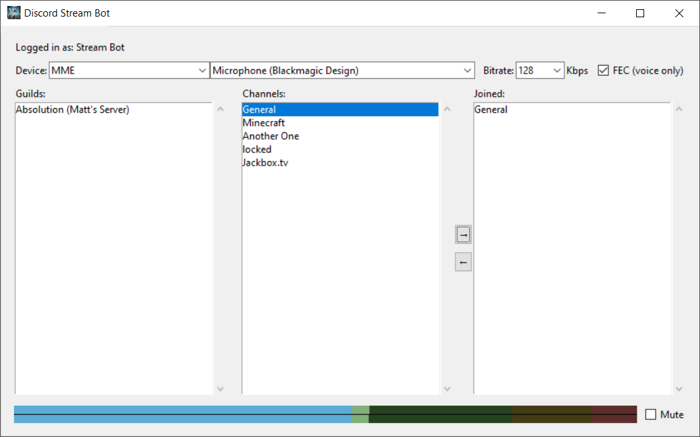

# discord-stream-bot

Enable stereo sound in a discord channel.

This Discord bot connects to a stereo microphone on your computer, so you can have stereo sound in your channels.



## Description

Discord transmits only mono sound to voice channel, which makes it a bad
experience in certain cases.
However, bot can transmit stereo sound to voice channel. Thus, you can connect
to your party channel as a bot. (You will need an admin to approve.)


## Installation

### uv - Windows

Add to environment variable `PATH`
```sh
%SYSTEMROOT%\System32\WindowsPowerShell\v1.0
```

Install uv
```sh
powershell -ExecutionPolicy ByPass -c "irm https://astral.sh/uv/install.ps1 | iex"
```

Install discord-mic-bot dependencies
```sh
uv venv
uv add -r requirements.txt
.\discord-mic-bot-uv.cmd
```

### Linux
You may also need to install libopus and libportaudio.

## Configuration

0) Obtain the token from an existing bot.
1) Add the token to `token.txt`

If a new bot needs to be created, follow the steps [here](documentation/README.md)

## Usage - Windows

`discord-mic-bot-uv.cmd` is the entry point.

## Usage - Linux

`discord-mic-bot` is the entry point.


## Monitoring loudness

The loudness meter is compatible to EBU R 128 / ITU-R BS.1770, showing the
perceptible loudness for the last 0.4 seconds.

```
-70 ================================= -32 ============= -14 ==== -5 === 0 LUFS
 |                Blue                 |      Green      | Yellow | Red |
-70 ================================= -32 ============= -14 ==== -5 === 0 LUFS
```
* The left end is calibrated to -70 LUFS.
* Between blue and green is -32 LUFS.
* Between green and yellow is -14 LUFS.
* Between yellow and red is -5 LUFS.
* The right end is calibrated to 0 LUFS.

For music streaming, it is recommended to aim for -14 LUFS.

But if you are playing the background music while people are speaking, try to
lower down an extra 20 dB. **(i.e., aim for -34 LUFS.)**

This widget is designed to only give you a rough intuition of your loudness. If
you want to seriously measure your outgoing signal, try
[Youlean Loudness Meter (shareware)](https://youlean.co/youlean-loudness-meter/)
for Windows and macOS or
[ebumeter](https://wiki.linuxaudio.org/apps/all/ebumeter) for Linux.

My [live-loudness-normalizer](https://github.com/m13253/sb-jsfx-plugins) plugin
can also help you manage your stream loudness in realtime.

## License

This program is free software: you can redistribute it and/or modify it under
the terms of the GNU General Public License as published by the Free Software
Foundation, either version 3 of the License, or (at your option) any later
version.

You should have received a copy of the [GNU General Public License](LICENSE)
along with this program.

## Acknowledgment

This program is forked from [discord-mic-bot](https://github.com/m13253/discord-mic-bot) inspired by (but not a fork from)
[discord-audio-pipe](https://github.com/QiCuiHub/discord-audio-pipe).
Thank you QiCuiHub!
